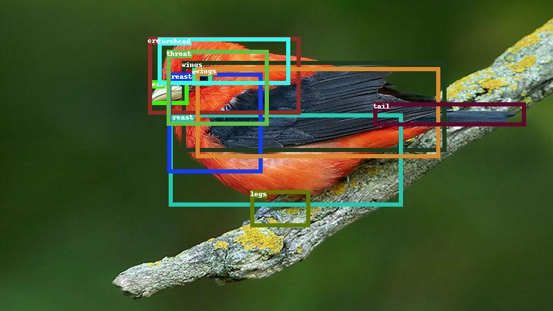
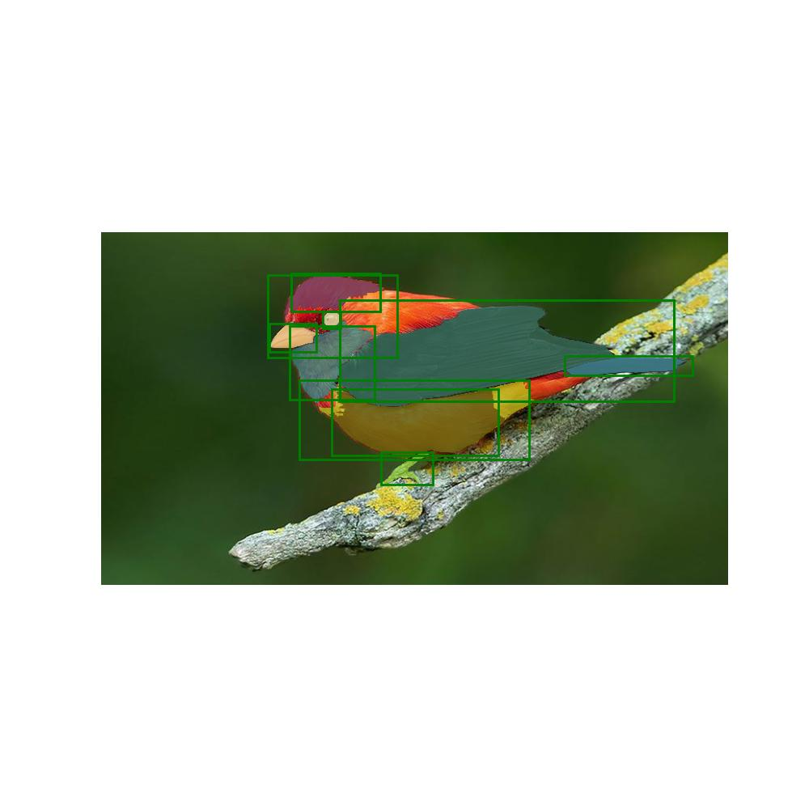
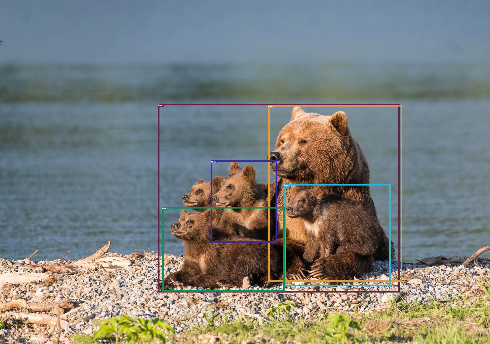
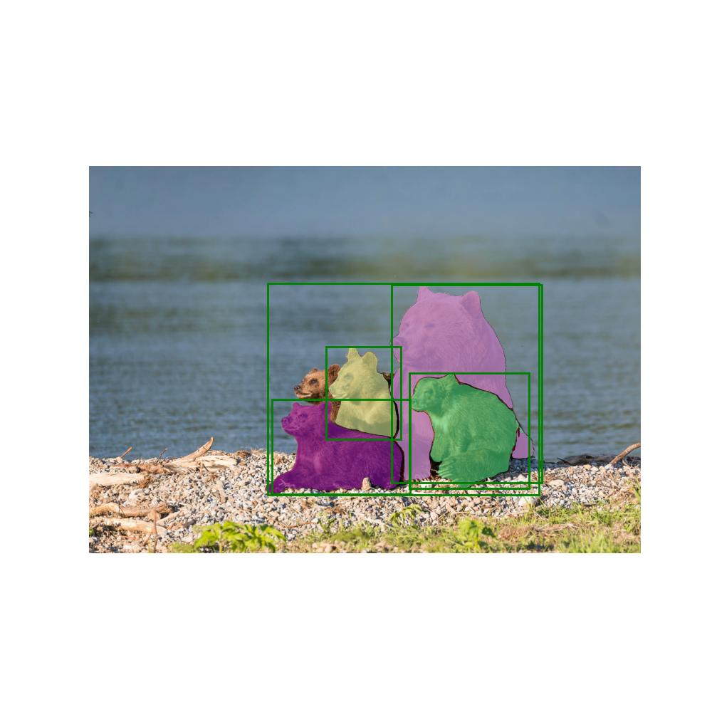

# Open-vocabulary-Segment-Anything
An interesting demo by combining [OWL-ViT](https://arxiv.org/abs/2205.06230) of Google and [Segment Anything](https://ai.facebook.com/research/publications/segment-anything/) of Meta!





`prompt: a bird with a yellow wing`

## Highlight
- Detect and Segment everything with Language!
- Detect objects in more details (small objects)
- Image-conditioned detection and Text-condition detection
- Use Stable Diffusion to do inpainting


## Catelog
- [x] OWL-ViT + Segment-Anything Demo
- [x] Image-conditioned detection
- [x] Inpainting using StableDiffusion
- [x] [Huggingface Demo](https://huggingface.co/spaces/ngthanhtinqn/Segment_Anything_With_OWL-ViT)

## Installation
The code requires `python>=3.8`, as well as `pytorch>=1.7` and `torchvision>=0.8`. Please follow the instructions [here](https://pytorch.org/get-started/locally/) to install both PyTorch and TorchVision dependencies. Installing both PyTorch and TorchVision with CUDA support is strongly recommended.

Install Segment Anything:

```bash
python -m pip install -e segment_anything
```

Install OWL-ViT (the OWL-ViT is included in transformer library):

```bash
pip install transformers
```

More details can be found in [installation segment anything](https://github.com/facebookresearch/segment-anything#installation)

## Run Demo

- download segment-anything checkpoint
```bash
wget https://dl.fbaipublicfiles.com/segment_anything/sam_vit_h_4b8939.pth
```

- Run demo
```bash
bash run_demo.sh
```



## Reference
Please give applause for [IDEA-Research](https://github.com/IDEA-Research/Grounded-Segment-Anything/tree/main/segment_anything) and [OWL-ViT on HuggingFace](https://huggingface.co/spaces/adirik/OWL-ViT)


## Citation
If you find this project helpful for your research, please consider citing the following BibTeX entry.
```BibTex
@article{kirillov2023segany,
  title={Segment Anything}, 
  author={Kirillov, Alexander and Mintun, Eric and Ravi, Nikhila and Mao, Hanzi and Rolland, Chloe and Gustafson, Laura and Xiao, Tete and Whitehead, Spencer and Berg, Alexander C. and Lo, Wan-Yen and Doll{\'a}r, Piotr and Girshick, Ross},
  journal={arXiv:2304.02643},
  year={2023}
}

@misc{minderer2022simple,
      title={Simple Open-Vocabulary Object Detection with Vision Transformers}, 
      author={Matthias Minderer and Alexey Gritsenko and Austin Stone and Maxim Neumann and Dirk Weissenborn and Alexey Dosovitskiy and Aravindh Mahendran and Anurag Arnab and Mostafa Dehghani and Zhuoran Shen and Xiao Wang and Xiaohua Zhai and Thomas Kipf and Neil Houlsby},
      year={2022},
      eprint={2205.06230},
      archivePrefix={arXiv},
      primaryClass={cs.CV}
}
```
